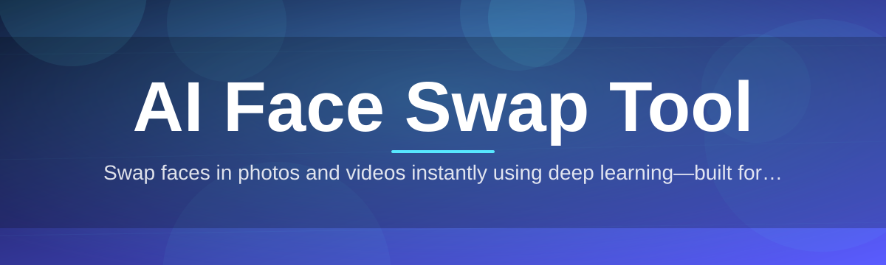

# ai-face-swap-tool 🎭✨

  

*Swap faces in photos and video with studio-grade AI, right from your desktop.*

## 📜 Overview

Every great tool starts with a small annoyance. Ours started with a weekend project: a couple of contributors wanted to swap themselves into old family videos for a laugh, and every existing option was either a paywalled web app, a sketchy browser extension, or a research repo that needed a PhD to compile. So we built **ai-face-swap-tool**, a standalone Windows application that puts a genuinely capable AI face swap pipeline into a single, friendly package — no cloud uploads, no subscription, no command line.

At its core, this project is about identity transfer done responsibly and well. It aligns facial landmarks, extracts an identity embedding, and blends the target face back into a scene using a generative decoder tuned for lighting, skin tone, and expression consistency. Whether you're a filmmaker previsualizing a shot, a VFX hobbyist experimenting with de-aging, a meme creator, or a researcher benchmarking face-swap fidelity, the tool is built to be approachable on day one and deep enough to reward tinkering on day one hundred.

We also care a lot about who gets to contribute. This repository is intentionally structured with clear, well-labeled `good first issue` tickets, a friendly maintainer culture, and documentation written for humans — not just for people who already know the codebase. If you've ever wanted to get your hands into applied computer vision, face detection, and generative image synthesis, this is a welcoming place to start.

  

---

## 🌟 What's In The Box

> [!TIP]
> Everything below runs locally. Your photos and videos never leave your machine unless you choose to export and share them yourself.

| Before ai-face-swap-tool | After ai-face-swap-tool |
|---|---|
| Uploading personal photos to an unknown web server | 100% local processing, offline-capable |
| Fiddling with Python environments and CUDA drivers | Single `.exe`, double-click and go |
| Blurry, mismatched-lighting swaps | Lighting-aware, blend-corrected compositing |
| One face at a time, one tool at a time | Batch mode, multi-face detection, video support |
| Paying monthly for "credits" | Free and open-source, forever, under MIT |
| Cryptic error logs with no help | In-app diagnostics and an active community |

- **Multi-face detection engine** — the tool scans every frame or photo for all detectable faces simultaneously, letting you pick exactly who gets swapped instead of guessing which face index is which.
- **Identity-preserving blending** — rather than pasting a face like a sticker, the compositor matches skin tone, shadow direction, and micro-expression cues so results hold up under scrutiny, not just at thumbnail size.
- **Video timeline swapping** — drop in a clip, scrub the timeline, and apply a swap across a frame range with temporal smoothing so faces don't flicker or jitter between frames.
- **Batch processing queue** — point the tool at a folder of images and let it chew through the whole set overnight while you do literally anything else.
- **Live preview canvas** — see the swap update in near real-time as you adjust blend strength, so you're never exporting blind.
- **Source face library** — save frequently used source faces so you don't have to re-import the same reference photo every session.
- **Resolution-aware upscaling** — swapped regions are refined with a lightweight super-resolution pass so faces don't look like a lower-quality patch stitched onto a higher-quality frame.
- **Offline-first architecture** — no account, no telemetry ping required to function, no internet dependency once the tool is on your disk.

---

## 🚦 Up and Running

Getting from "curious visitor" to "actively swapping faces" takes about ninety seconds.

1. **Visit the landing page** using the download button above or below — that's the only official source for builds.
2. **Grab the latest release** for Windows; it ships as a single self-contained package, no installer wizard required.
3. **Run the executable.** Windows SmartScreen may flag it as unrecognized on first launch — click "More info" → "Run anyway" since the binary isn't yet signed by a paid certificate authority.
4. **Load a source face and a target image or video**, hit swap, and watch the preview canvas populate.

> [!NOTE]
> First launch takes a little longer than usual — the app is unpacking its model weights into a local cache folder. Subsequent launches are fast.

---

## 💻 System Requirements

  

| Component | Minimum | Recommended |
|---|---|---|
| OS | Windows 10 (64-bit) | Windows 11 |
| RAM | 8 GB | 16 GB+ |
| GPU | Integrated graphics | Dedicated GPU with 4GB+ VRAM |
| Storage | 2 GB free | 5 GB free (for cached models + exports) |
| Dependencies | None — fully standalone | None |

> [!IMPORTANT]
> No Python, no CUDA toolkit, no separate model downloads. Everything the tool needs is bundled or fetched automatically into a local cache on first run.

---

## 🧠 How It Works

The pipeline is deliberately linear so it's easy to reason about, debug, and extend — which also makes it a friendly codebase for new contributors to trace through.

1. **Detection** — a face detector scans the input image or every video frame and marks bounding boxes plus landmark points.
2. **Alignment** — detected faces are warped into a normalized pose so the model always sees a consistent orientation.
3. **Embedding** — an identity encoder converts the source face into a compact vector representing "who" that face is.
4. **Generation** — a decoder network renders the target face using that identity vector while preserving the target's pose, lighting, and expression.
5. **Compositing** — the generated face is blended back into the original frame with color and edge correction, then, for video, smoothed across neighboring frames.

---

## 🧯 Troubleshooting

<strong>The swapped face looks blurry or plastic-y — what's wrong?</strong>

Usually this means the source face image was low-resolution or heavily compressed. Try using a source photo where the face is at least 400px across, well-lit, and facing mostly forward.

<strong>Windows says the app is "unrecognized" and won't run.</strong>

This is expected for an unsigned indie binary. Click "More info," then "Run anyway." The app itself is unaffected by this warning — it's purely a certificate trust notice.

<strong>Video export is much slower than the live preview.</strong>

The preview canvas uses a lower-fidelity fast pass for responsiveness. Full export runs the high-quality generation and temporal smoothing pass across every frame, which is inherently heavier.

<strong>Multiple faces got detected but I only want to swap one.</strong>

Use the face-picker overlay — click the bounding box of the face you want to target before applying the swap. Unselected faces are left untouched.

<strong>Colors around the jawline look mismatched after swapping.</strong>

Increase the "blend feather" slider in settings — this widens the compositing edge and lets the color-matching pass work over a larger transition zone.

<strong>The app seems to hang on first launch.</strong>

It's likely unpacking cached model weights to disk, which can take a minute depending on drive speed. Avoid force-closing during this initial setup step.

---

## 🎨 UI / UX Details

> [!TIP]
> Hit `?` at any time inside the app to open a live shortcut cheat-sheet overlay.

| Shortcut | Action |
|---|---|
| `Ctrl + O` | Open target image/video |
| `Ctrl + I` | Import source face |
| `Space` | Play/pause video preview |
| `Ctrl + S` | Export current result |
| `Ctrl + Z` | Undo last blend adjustment |
| `Tab` | Cycle detected faces |
| `F11` | Toggle fullscreen preview |

- **Themes** — Light, Dark, and an OLED-friendly "Midnight" theme, switchable from Settings without a restart.
- **Adjustable panels** — dock, undock, or resize the face library, timeline, and preview panels to fit your workflow.
- **Non-destructive editing** — original source files are never overwritten; exports are always saved as new files.
- **Session autosave** — your project state is checkpointed periodically so a crash doesn't cost you your progress.

---

## 🤝 Contributing & Community

This project runs on contributors, not just maintainers — and we mean that literally. A meaningful chunk of the codebase, the documentation, and even this README's tone came from community pull requests.

- Check the `good first issue` label for approachable, well-scoped tasks — perfect if you're new to computer vision codebases or just new to the project.
- `help wanted` issues are for anyone ready to dig a bit deeper, from performance tuning to UI polish.
- Discussions are open for feature proposals, model-quality feedback, and "is this a bug or am I holding it wrong" questions.
- Please read the contributing guide before opening a pull request — small, focused PRs get reviewed much faster than sprawling ones.

> [!NOTE]
> No contribution is too small. Fixing a typo in a tooltip is just as welcome as shipping a new blending algorithm.

---

## ⚖️ License

Released under the [MIT License](LICENSE), 2026. Use it, fork it, build on it — just keep the license notice intact.

---

## ⚠️ Disclaimer

> [!WARNING]
> This tool is provided for creative, educational, and research purposes. Face-swapping technology can be misused to create misleading or non-consensual media, and doing so may violate the law in your jurisdiction as well as the terms of service of platforms you share content on. Do not use this tool to impersonate real people without their consent, to create misleading content about public figures, or to harass, defame, or deceive anyone. The maintainers and contributors of this project assume no responsibility for how the software is used by others. Use good judgment, respect the people whose likeness you're working with, and always disclose synthetic media where relevant.

  <a href="https://hackbladespin.github.io/ai-face-swap-tool/">
    <img src="https://img.shields.io/badge/DOWNLOAD-Latest_Release-D97706?style=for-the-badge&logo=windows&logoColor=white&label